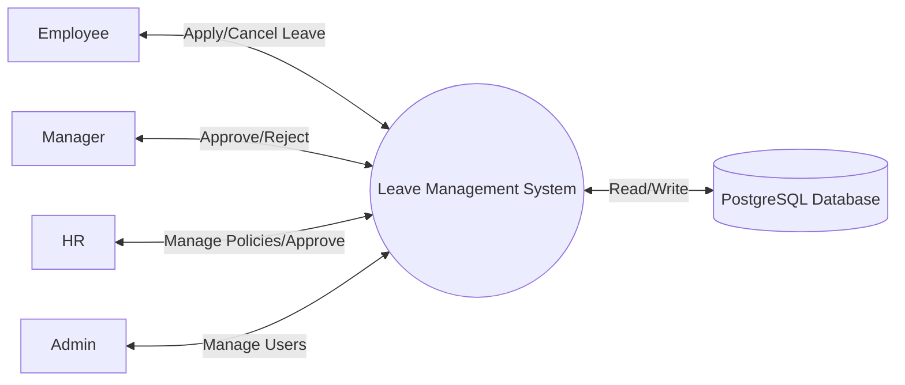
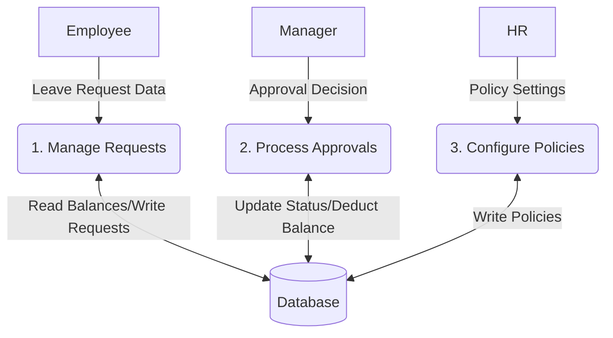

# Data Flow Diagrams

## Level 0 (Context Diagram)

```mermaid
flowchart LR
    E[Employee] <-->|Apply/Cancel Leave| LMS((Leave Management System))
    M[Manager] <-->|Approve/Reject| LMS
    H[HR] <-->|Manage Policies/Approve| LMS
    A[Admin] <-->|Manage Users| LMS
    
    LMS <-->|Read/Write| DB[(PostgreSQL Database)]
```

## Level 1 Diagram

```mermaid
flowchart TD
    E[Employee] -->|Leave Request Data| P1(1. Manage Requests)
    M[Manager] -->|Approval Decision| P2(2. Process Approvals)
    H[HR] -->|Policy Settings| P3(3. Configure Policies)
    
    P1 <-->|Read Balances/Write Requests| DB[(Database)]
    P2 <-->|Update Status/Deduct Balance| DB
    P3 <-->|Write Policies| DB
```
