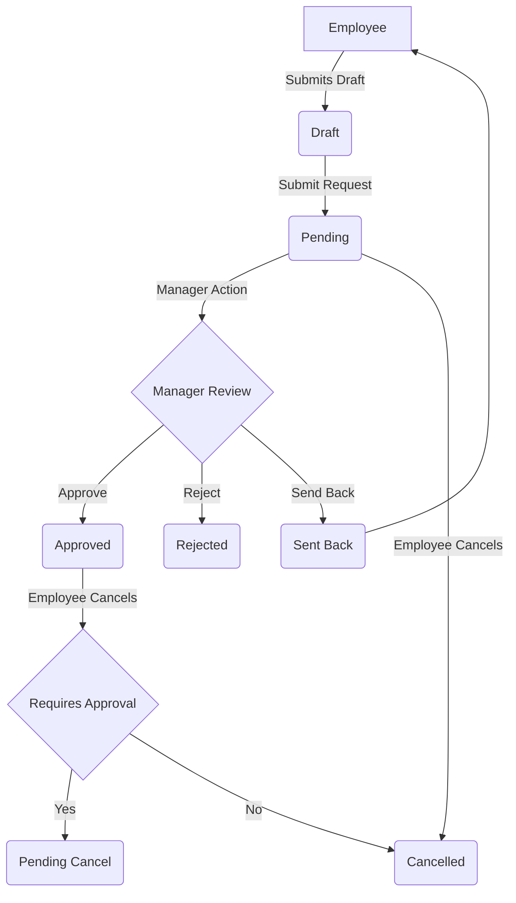

# Leave Lifecycle Workflow

```mermaid
flowchart TD
    A[Employee] -->|Submits Draft| B(Draft)
    B -->|Submit Request| C(Pending)
    C -->|Manager Action| D{Manager Review}
    
    D -->|Approve| E(Approved)
    D -->|Reject| F(Rejected)
    D -->|Send Back| G(Sent Back)
    
    G --> A
    
    C -->|Employee Cancels| H(Cancelled)
    E -->|Employee Cancels| I{Requires Approval}
    I -->|Yes| J(Pending Cancel)
    I -->|No| H
```
